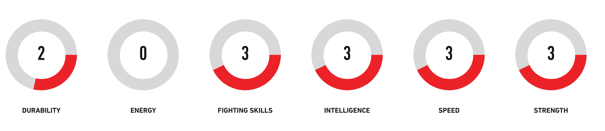

# marvel-comics-api-json-data-metrics

## To run as a JAR file

Download the JAR file: *challenge-1.0-SNAPSHOT-jar-with-dependencies.jar*
The JAR file contains all dependencies and can be run with one of three options as follows:


"characters"              - for a top 10 listing of the most popular characters
"charactes {charactedId}" - for more details on a specific character
"powers {characterId}     - for character special power details, if available on related wiki page

Examples of how to run the JAR file with commands.


```shell
java -jar challenge-1.0-SNAPSHOT-jar-with-dependencies.jar characters 1010846

java -jar challenge-1.0-SNAPSHOT-jar-with-dependencies.jar powers 1010846

java -jar challenge-1.0-SNAPSHOT-jar-with-dependencies.jar characters
```

## To run a a Maven project
Clone the repository and run:

```shell
mvn install
mvn compile

#Example calls with arguments
mvn exec:java -Dexec.args="characters"
mvn exec:java -Dexec.args="characters 1010846"
mvn exec:java -Dexec.args="powers 1010846"
```

## Marvel Character Powers
The character powers are scraped from a character's wiki page if the page url is available and if the page contains the corresponding section. The secion that is used is a circle rating area at the bottom of most character wiki pages and the data it represents is what's used in the JSON response, namely: durability, energy, fighting skills, intelligence, speed, strength.

### Project Structure

